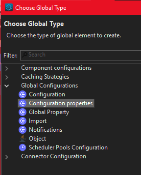

# Practica MuleSoft 

### Jonatan Alejandro Castro Mejia

Guia de Uso e instalación de MuleSoft.

## A) Registro e Instalación

```markdown
1. Crear una cuenta en Mulesoft 
```

[En este link.](https://anypoint.mulesoft.com/login/signup?apintent=generic)

```markdown
2. Registrarse y Descargar Anypoint Studio (prueba gratuita por 30 dias)
```
[En este link.](https://www.mulesoft.com/lp/dl/studio)

```markdown
3. Descomprimir el archivo AnypointStudio-7.11.0-win64 (en mi caso para windows)
```

```markdown
4. Acceder a la carpeta resultante "AnypointStudio"
```

```markdown
5. Ejecutar el archivo "AnyPoint.exe"
```
```markdown
6. Elegimos la direccion del Workspace y Presionamos "Launch" 
```

  

## B) Creacion de un nuevo proyecto Mule
```markdown
1. Presionamos "Create a Mule Proyect"
```

```markdown
2. Ingresamos el nombre del proyecto, en mi caso "HelloMule" y presionamos "Finish"
```


```markdown
Ahora nuestro entorno se modificara y apareceran elementos nuevos.
```


```markdown
En la parte de Palette podemos arrastrar de los elementos que necesitemos, hasta el archivo que se encuentra abierto, en este caso el archivo es "hellomule.xml" 
```

```markdown
Arrastremos y soltemos el elemento "Listener" dentro del archivo
```

```markdown
Al hacer click en el circulo de Listener o en el icono de Listener
```

```markdown
Se abriran las opciones para el mismo 
```

```markdown
Nos dirigimos a la seccion de Basic Settings y presionamos el Boton de @icon-plus, se abrirá la siguiente ventana:
```

```markdown
Como podemos observar en esta ventana es donde podemos configurar la conexión, es decir:
* Asignarle un nombre
* Elegir que protocolo, 
* Definir el host 
* Definir el puerto 
En este caso no modificamos nada y simplemente presionamos "OK".
```

```markdown
Ahora veremos que el nombre que asignamos, aparece en el campo de "Connector configuration"
```

```markdown
Lo que sigue es definir la dirección o el "Path"
```


```markdown
Este "Path" será un endpoint que ejecutará el flujo cuando el Listener la capte o la escuche 
```

```markdown
Ahora arrastramos y soltamos el elemento "Set Playload" dentro del flujo.
```


```markdown
 Se abrirán las opciones de Set Playload, modificaremos el valor de fx.
```


* Presionamos el botón de fx e ingresamos la cadena "Hello Mule".


```markdown
Ahora guardaremos el proyecto presionando en la parte superior izquierda File y después Save o simplemente CTRL + S 
```

```markdown
Ahora ejecutaremos el proyecto dando click derecho en el flujo y presionamos " @icon-play Run proyect hellomule "

Si todo salio bien, obtendremos este resultado:
```


```markdown
Ahora abriremos Postman o descargaremos MuleSofts Advanced REST Client para hacer una petición a nuestro endpoint

En mi caso yo usaré Postman

Haremos una petición POST con la direccion definida en el Listener (http://0.0.0.0:8081/hellomule)  
```


```markdown
Al presionar "Send" la respuesta que obtendremos será:
```


## Desplegar proyecto Mule en CloudHub.

```markdown
1. Detenemos la ejecución del proyecto Mule, dando click derecho sobre el flujo y presionando "@icon-stop proyect hellomule"
```


```markdown
2. Damos click derecho sobre el archivo hellomule.xml, luego en Anypoint Platform y seleccionamos Deploy to CloudHub.
```

```markdown
3. Nos pedira acceso ya que es por primera vez que tratamos de hacer deploy.
```


```markdown
4. Una vez que accedemos, se abrirá una ventana como la siguiente:
```


Observamos que en la parte superior izquierda tenemos un botón con leyenda "DESING", lo presionamos y cambiamos a SandBox


cambiamos a SandBox seleccionándolo y presionando "Switch"

```markdown
5. pasamos el cursor sobre el nombre de la aplicación
 * si este tiene @icon-times varificamos el error y lo trataremos de arreglar
 
 En mi caso el nombre del proyecto ya estaba en uso, por eso lo cambie a hellomule100

Esto es importante ya con errores no se podrá desplegar en CloudHub.
```


```markdown
6. Ahora presionamos "Deploy Application" y obtendremos la siguiente ventana:
```


```markdown
7. Presionamos "Open in Browser" y accedemos con nuestra cuenta
```


```markdown
8. Al acceder de forma satisfactorira se nos mostrará la siguiente pestaña, y al igual que antes, presionamos el botón de "Desing" y cambiamos a "Sandbox"
```


```markdown
9. Ahora preisonamos el nombre del proyecto "hellomule100" y se nos redireccionará a otra pestaña.
```


En esta pestaña podremos ver, el dominio de nuestro proyecto ya desplegado en CloudHub.

En mi caso es 

[Este link](http://hellomule100.us-e2.cloudhub.io/)

Pero como recordaremos, para verificar la respuesta de la petición que creamos, es necesario acceder desde Postman (para hacer una petición POST)


```markdown
10. Presionamos "Send"

Y verificamos la respuesta ¡Listo!
```


# b) Como Configurar un endpoint con protocolo HTTPS en Anypoint Studio.

```markdown
1. Nos dirigimos a la carpeta src/main/resources y creamos un archivo(click derecho -> new -> File) con el nombre: local.properties

En este archivo "definiremos" las propiedades de una conexión con protocolo HTTPS

```


```markdown
2. Regresamos al archivo hellomule.xml tendremos lo siguiente
```


```markdown
3. Seleccionamos HTTP_Listener_config, 
    * Presionamos Edit
    * Cambiamos el protocolo por HTTPS y
    * Modificamos el puerto por $(https.port)
```


```markdown
4. Probamos la conexión y veremos que esta fallará, ya que hay que agregar una configuración global para la conexión. (si continua fallando no hacer el archivo local.properties y simplemente cambiar de puerto a 8082)
```


```markdown
5. Cerramos las ventanas de prueba de conexión y de edición de la conexión y regresamos al archivo hellomule.xml
```


```markdown
6. Presionamos "Create" 
```


Global Configurations -> Configuration properties


```markdown
7. Seleccionamos el archivo que creamos (local.properties) y presionamos "OK"
```
 @icon-arrow-right

Presionamos "OK"

Y ahora tendremos otro elemento 


```markdown
8. Regresamos al archivo hellomule.xml, seleccionamos HTTP_listener_config y presionamos edit 
```

```markdown
9. Nos dirigimos a la pestaña TLS y cambiaremos la configuracion TLS (de none a EditInline)

Para eso crearemos un archivo keystore (jks)
```

```markdown
10. Abriremos una terminal 

11. Escribimos los siguientes comandos

cd \  ------------------------(para colocarnos en c: )
dir /b/s keytool.exe ---------(para buscar el archivo ejecutable keytool.exe)

```
Para una guia completa seguir este [mini tutorial](https://support.code42.com/Administrator/6/Configuring/Install_a_CA-signed_SSL_certificate_for_HTTPS_console_access)

Usaremos el de java.


```markdown
12. Escribimos el comando 
PATH=%PATH%;C:\Program Files\Java\jdk-15.0.2\bin 

En mi caso tengo una version de java relativamente reciente, pero puede usar alguna anterior también.
```
```markdown
13. Escribimos el comando cd \Users\<yourusername>
(cambia yourusername por tu nombre de usuario) 
```
```markdown
14. Ahora escribimos el siguiente comando 

keytool -genkey -alias <key-alias> -keystore <keystore-name>.jks -keyalg RSA -storetype JKS

los elementos dentro de <> los puedes modificar a tu placer.
```

```markdown
Y finalmente obtendremos un archivo .jks dentro de la carpeta \Users\<yourusername>.
```

```markdown
15. Ahora hay que mover el archivo.jks a la carpeta src/main/resources dentro del proyecto
```


```markdown
16. Regresamos a configurar TLS del Listener. 

En TLS Configuration cambiamos de None a Edit Inline y nos aparecerán los campos para configurar TLS.
```


```markdown
17. Dentro de los campos de Key Store Configuration agregaremos 

* En Path el nombre del archivo que generamos y copiamos a la carpeta src/main/resources 
* El alias que proporcionamos via terminal (en mi caso key-alias)
* Y el password (en mi caso password)
```


```markdown
18. Probamos la conexión.
```


Y ¡Listo! la conexión ahora tendrá un protocolo HTTPS 

```markdown
19. Probemos la conexión en Postman (ejecutando el proyecto en Anypoint Studio antes) Verificamos que en la configuracion de Postman
```


esta opción este desactivada


Ahora ingresamos a https://0.0.0.0:8082/hellomule


damos Click en Send


y vemos que la respuesta es correcta para ese endpoint.

¡Listo! Terminamos de verificar que la conexión ahora tiene protocolo https.


# C) ¿Cómo configurar un protocolo HTTPS para todos los endpoints? (De forma global y no para cada uno)

```markdown 
1. Abrimos nuestro archivo local.properties con Mule Properties Editor.

2. ingresamos lo siguiente:

salesforceUsername=<yourUsername>
salesforcePassword=<yourPassword>

<> debes de modificarlo con tus datos que refistraste anteriormente

```

[link con guía de instalación de Mule Properties Editor](https://mulesy.com/adding-secure-property-plugin-or-editor/)

```markdown 
4. Ahora dentro de la paleta presionamos la opción "Search in Exchange", se abrirá una ventana como la siguiente:
```


```markdown
5. Buscamos Mule Secure Configuration Property Extension, la seleccionamos y presionamos Add> y despues Finish
```


```markdown
6. Veremos que se agregara a los elementos dentro la Paleta de mule y en los paquetes
```


```markdown
7. Ahora nos dirigimos a la sección de elementos globales, presionamos el botón de create 
```


```markdown
8. Escribimos la palabra global y Seleccionamos la opción "Global Property" y Presionamos "OK"
```


```markdown
9. Ahora se abrira una ventana como la siguiente:
```


```markdown
10. Aqui ingresaremos los algunos datos que tendremos que recordar 

Por ejemplo yo agregue: 

* Name : secure-key
* Value: MulesoftValue

Y presionamos "OK"
```


Ahora será un elemento global


```markdown
11. Preisonamos el botón de Create y buscamos "Secure Properties Config", lo seleccionamos y presionamos "OK"
```


Se abrirá la siguiente ventana: 


```markdown
12. Llenamos los campos (o seleccionamos)

* File
* Key
* Algorithm


```


Y presionamos "OK"

```markdown
13. Ahora buscaremos una dependencia para agregarla a los elementos de la paleta, esta será "Salesforce Connector" lo agregamos y presionamos "Finish"
```


Anteriormente definimos una respuesta con Set Playload, y ahora lo que haremos es cambiarlo por un elemento de Salesforce, en este caso lo cambiaremos por un elemento "Create"


```markdown
14. Reemplazamos Set Playload con Create.
```


```markdown
15. Presionamos el elemento Create dentro del flujo y aparecera su configuración.
```


```markdown
16. Presionamos el botón @icon-plus dentro de Basic Settings, se abrirá una ventana y agregaremos los siguientes datos: 

En Username: $(secure::salesforceUserName)
En Password: $(secure::salesforcePassword)

Y presionamos "OK"
```


```markdown
17. Después en la cofiguración de Create, en la Sección General modificamos lo siguiente:

* Type: lead
* Records:

%dw 2.0
output application/json
---
[{
	FirstName: "Max",
	LastName: "Mule",
	Email: "maxthemule@mulesoft.com",
	Company: "MuleSoft"
}]
```

```markdown
18. nos dirijimos al archivo local.properties y damos doble click en salesforceUserName, después damos click en encrypt
```


Se mostrará una ventana con dos campos, una para elegir un algoritmo de encriptación y la llave que definimos en el paso **10**, al precionar "OK"
regresaremos y veremos que el username ahora estará encriptado, presionamos "OK"


```markdown
19. Repetimos con el password.
```


```markdown
20. Ahora hay que desplegar el proyecto en CloudHub, Agregando el nombre y la llave de seguridad del paso 10.
```


ya en el navegador, podremos observar que se actualizo!

